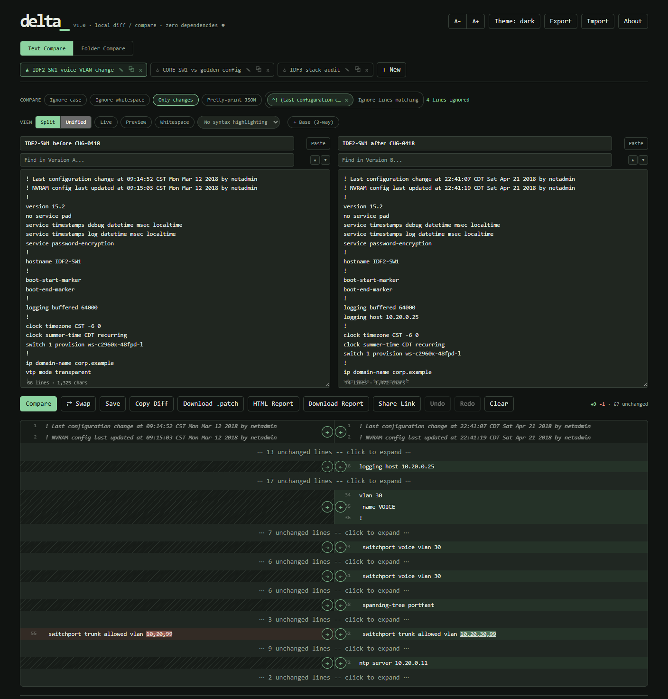

# Delta v1.0

Delta is the local-first diff tool I wanted for comparing switch configs, firewall exports, and other text that should never be pasted into a website.

It is a plain HTML page with no build step and no server. I open `delta/index.html` in a modern browser, paste or drop two versions in, and compare them. Nothing is uploaded: saved comparisons stay in that browser's local storage.

That storage is the only copy, so use **Export** now and then to keep a JSON backup.

## What it is

- Line-level diff with word- and character-level highlighting inside changed lines, in **Split** or **Unified** view
- Ignore case, ignore whitespace, only-show-changes, and pretty-print-JSON-before-comparing toggles
- **Ignore lines matching (regex)**: add several patterns as removable pills, so timestamps, serial numbers, or `! Last configuration change` lines stop showing up as differences
- **Base / 3-way** mode: compare A and B against a shared original, with a full 3-way merge that auto-merges one-sided changes and flags real conflicts for you to resolve
- Copy-to-other-side arrows on each change in Split view, with undo
- `]` / `[` change navigation, bookmarks on changes, and per-pane find
- **Live** mode (re-compare as you stop typing) and **Preview** mode (render HTML or Markdown)
- **Whitespace** toggle that shows every space and tab
- Optional syntax highlighting for JS/TS, Python, JSON, CSS, HTML/XML, Bash, SQL, YAML, Go, Rust, Java, C#, C/C++, and Markdown
- **Folder Compare**: pick two local folders and see every file as added, removed, modified, or unchanged by SHA-256 content hash; modified text files open in the same diff view, and modified images get a pixel-difference overlay
- Named saved comparisons as tabs, with autosave of the current pair and undo/redo across typing, paste, drop, swap, clear, and load
- **Copy Diff**, **Download .patch**, a standalone light-themed **HTML Report**, a **Share Link** that carries the comparison in the URL, and JSON export/import
- System, light, dark, and Vegas neon themes on the **Theme** button, following the system setting by default (Vegas motion stops when the system asks for reduced motion)
- Adjustable text size and line/character counts per pane

## Run it

Download or clone this repository, then open `delta/index.html` directly in a modern browser. There is no install step and no server to run.

Folder Compare needs a browser that supports picking a folder (current Chrome, Edge, and Firefox do).

## Useful shortcuts

| Shortcut | Action |
| --- | --- |
| `Ctrl+Enter` | Run compare |
| `Ctrl+S` | Save the comparison |
| `Ctrl+Z` | Undo the last edit, paste, drop, swap, clear, or load |
| `Ctrl+Shift+Z` or `Ctrl+Y` | Redo |
| `]` / `[` | Jump to the next / previous change |
| `Alt+→` / `Alt+←` | Copy the selected change to Version B / A (Split view) |
| `B` | Bookmark or unbookmark the selected change |
| `}` / `{` | Jump to the next / previous bookmarked change |

## Third-party code

Syntax highlighting uses [Prism.js](https://prismjs.com) (MIT License), vendored in `delta/vendor/prism/` with its license and never loaded from a CDN. Everything else is hand-written with no dependencies.

## License

MIT. See [`LICENSE`](LICENSE).

I’m calling this release **v1.0**.
